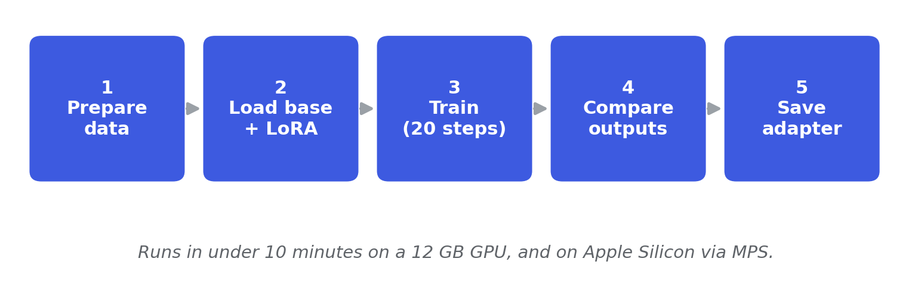

# Chapter 2: How to do model adaptation



*The five steps this chapter walks through. You prepare a small slice of the IT-support data, load the base model with a LoRA adapter, train briefly, compare the adapted outputs against the base, and save the adapter. The whole loop runs in under 10 minutes on a 12 GB GPU, and on Apple Silicon via MPS.*

This folder backs Chapter 2's hands-on quickstart. The chapter itself is a landscape chapter: it walks the adaptation continuum, the buy-versus-build decision, base model selection, and security considerations. The two pieces of code in this folder play two roles:

1. **`quickstart.py`** is what chapter 2's section 2.8 walks through: a small five-step LoRA fine-tune on Qwen3-4B-Instruct-2507 using a 40-example slice of the book's IT-support dataset. It loads the prepared data from `data/it_support_fmt` (and `data/it_support/valid.jsonl`), so build the dataset once first (see "Preparing the data" below). It runs in under 10 minutes on a 12 GB GPU and lands on the same base model the rest of the book uses, so the adapter it produces is a valid starting point for chapter 5.
2. **`run_chapter5_adapter.py`** is an optional script for curious readers. It loads the chapter 5 LoRA adapter onto the base model and runs the same three demo prompts the quickstart prints, side by side with the base model output. The script resolves the adapter in three tiers: local `chapter05/runs/it_lora/` first, then Hugging Face Hub (`bahree/qwen3-4b-it-lora-ch5` by default), then optionally the local Ch2 quickstart adapter (only when `--use-quickstart` is passed). Most readers will get the Hub path automatically; readers who have run Ch5 locally get their own copy; readers who only have the quickstart see a clearly-labelled fallback. The script errors with the three resolution paths printed if none is available.

## Assumptions

This README assumes you have completed the one-time setup from [`code/README.md`](../README.md) (Python 3.12+, virtual environment, PyTorch). If not, start there first.

**The quickstart needs only the base install** (no chapter-specific extras):

```bash
pip install -e ".[dev]"
```

The quickstart uses TRL and PEFT, which are part of the base install, so it runs anywhere PyTorch works, including Apple Silicon via MPS (give it a 16 GB+ Mac; training is slow on unified memory).

## Hardware requirements

| Use case | GPU | VRAM | Time on A30 |
|---|---|---|---|
| `quickstart.py` (Chapter 2 §2.8) | NVIDIA, CUDA (or Apple Silicon MPS) | 12 GB+ (16 GB+ unified on Mac) | ~8 minutes end to end |
| CPU only | n/a | n/a | Not recommended (hours) |

The book's spine model (used in chapters 4 through 9) is `Qwen/Qwen3-4B-Instruct-2507`. The quickstart uses this model.

## Preparing the data

The quickstart trains on the book's **IT-support dataset**: real Stack Exchange IT Q&A (Super User, Ask Ubuntu, and Server Fault), plus a small Databricks Dolly mix-in for general-capability retention. Build it once from the `code/` directory before running the quickstart:

```bash
# 1. Build the dataset -> data/it_support/ (train.jsonl, valid.jsonl, preferences.jsonl, manifest.json, attribution.jsonl)
python scripts/build_it_support_dataset.py

# 2. Reformat answers into the house style -> data/it_support_fmt/train.jsonl
python scripts/reformat_it_answers.py
```

The builder depends on `beautifulsoup4` (to clean the Stack Exchange HTML) and `datasets`, both part of the base install. Per-example source URLs for the Stack Exchange content are written to `data/it_support/attribution.jsonl`. The quickstart then loads `data/it_support_fmt/train.jsonl` and `data/it_support/valid.jsonl`.

## Running the quickstart (Chapter 2 §2.8)

From the `code/` directory with your venv activated:

```bash
cd /path/to/repo/code
source .venv/bin/activate

# One-time install (covers the quickstart)
pip install -e ".[dev]"

# Build the IT-support dataset once (see "Preparing the data" above)
python scripts/build_it_support_dataset.py
python scripts/reformat_it_answers.py

# Run the five-step LoRA fine-tune
python -m chapter02.quickstart
```

What you should see:

```
Step 1: prepare dataset
  train=40 valid=5 demo=3
Step 2: load base model and configure LoRA
Step 3: train for 20 steps
  train wall time: ~56s on A30
Step 4: compare outputs on held-out prompts
  ...
Step 5: save adapter to chapter02/runs/ch2_quickstart
Done.
```

Outputs land in `chapter02/runs/ch2_quickstart/`:

- `adapter_model.safetensors` (~130 MB) and `adapter_config.json`: the trained LoRA adapter
- Tokenizer files: ensure the adapter is loadable without a second download
- `manifest.json`: seed, base model, hyperparameters, and the three sample generations

Chapter 5's training scripts can resume from this checkpoint directory, so the quickstart adapter is a valid starting point for the deeper chapter 5 work.

## Running the optional Ch5-adapter preview

```bash
# Default: tries local Ch5 path, then Hugging Face Hub
python -m chapter02.run_chapter5_adapter

# Override the Hub repo if the canonical adapter has moved
python -m chapter02.run_chapter5_adapter --hub-repo your-org/your-adapter

# Fall back to the local quickstart adapter as a last resort
python -m chapter02.run_chapter5_adapter --use-quickstart
```

## Publishing the Ch5 adapter to Hugging Face Hub

Whoever maintains the book pushes the canonical Ch5 adapter to the Hub once after each chapter 5 retrain, using the chapter 5 publish script:

```bash
huggingface-cli login   # one time, with a token that has write scope on the target repo

python chapter05/scripts/publish_adapter.py \
  --adapter chapter05/runs/it_lora \
  --repo_id bahree/qwen3-4b-it-lora-ch5 \
  --base Qwen/Qwen3-4B-Instruct-2507 \
  --notes "Chapter 5 LoRA adapter on Qwen3-4B + the IT-support dataset (Stack Exchange IT Q&A plus a Dolly mix-in, seed 42)"
```

After the push, `chapter02/run_chapter5_adapter.py` resolves to the Hub automatically.

## What gets downloaded on first run

| Asset | Source | Used by |
|---|---|---|
| Qwen3-4B-Instruct-2507 | `Qwen/Qwen3-4B-Instruct-2507` | quickstart.py |

The IT-support dataset is built locally by `scripts/build_it_support_dataset.py` (see "Preparing the data"); that builder is what pulls the Stack Exchange and Dolly source content. The quickstart itself only loads the prepared files from `data/it_support_fmt` and `data/it_support`. The quickstart's model download is small: Qwen3-4B is ~8 GB, and the prepared 40-example slice is a handful of KB.

## Troubleshooting

**CUDA out of memory** in the quickstart: this should not happen on a 12 GB GPU. If it does, set `per_device_train_batch_size=1` (the default) and confirm `gradient_checkpointing_enable()` was called. As a fallback, reduce `max_length` from 512 to 256 in `quickstart.py`.

**Slow dataset download** on first run: set `HF_TOKEN` in your environment to use authenticated downloads.

---

**Repository:** <https://github.com/bahree/ModelAdaptationBook>
