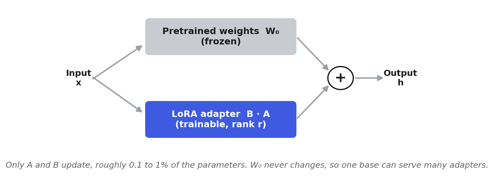

# Chapter 5 - LoRA and QLoRA Fine-Tuning (Qwen3-4B)



*How LoRA works. The pretrained weights stay frozen; a small low-rank adapter (B and A) is the only trainable part, and its output is added to the base. Because the base never changes, one copy can serve many adapters. This chapter trains LoRA and QLoRA adapters on the IT-support dataset.*

This chapter demonstrates parameter-efficient fine-tuning using LoRA and QLoRA on **`Qwen/Qwen3-4B-Instruct-2507`**. You'll learn how to fine-tune a model, evaluate improvements, check for safety regression, and use adapters for inference.

**Repository**: <https://github.com/bahree/ModelAdaptationBook>

### Where is the code?

All Chapter 5 code is in **this folder** (`code/chapter05/`):

| Location | What you'll find |
|----------|------------------|
| **`scripts/`** | Scripts you run (prepare dataset, evaluate, validate). |
| **`*.py`** (this folder) | Python package (training, eval, modeling). Run as `python -m chapter05.train_lora` etc. |
| **`data/`** | Data files and golden sets. |

Shared utilities (JSONL, env, seed) live in **`code/common/`**. Install from `code/` with `pip install -e .`.

**Chapter outline and listing map:**

| Listing | In the chapter | In the repo |
|---------|----------------|-------------|
| **5.1** | Data format; build dataset | `scripts/build_it_support_dataset.py` |
| **5.2** | LoRA config + SFTTrainer | `modeling.py`, `train_lora.py` |
| **5.3** | Evaluation | `scripts/listing_5_3_evaluate.py` |
| **5.4** | Inference with adapter | `generate.py` |
| **5.5** | QLoRA 4-bit loading | `train_qlora.py` |
| **5.6** | Safety regression test | `scripts/listing_5_3_evaluate.py` (safety section) |

**Data folder (`data/`):** The book's IT support dataset is built locally from real Stack Exchange IT Q&A (Super User, Ask Ubuntu, Server Fault) with a small Databricks Dolly mix-in for general-capability retention. Build it with `python scripts/build_it_support_dataset.py` (writes `data/it_support/`), then `python scripts/reformat_it_answers.py` (writes house-format `data/it_support_fmt/train.jsonl`). The repo includes `golden/` (small test files for eval) and `smoke/` (minimal train/valid for `validate_chapter05.py`).

**What are `data.py` and `dataset.py`?**  
- **`data.py`** - Loads chat JSONL (messages format) into `ChatExample` objects; used by training and eval to read your train/valid/test files.  
- **`dataset.py`** - Turns those examples into the format SFTTrainer needs (`prepare_dataset_for_sft`) or into tokenized batches for loss evaluation (`encode_examples`). Both are core to the chapter flow, not legacy.

---

## What We're Fine-Tuning

We're fine-tuning Qwen3-4B-Instruct-2507 on the book's IT support dataset to adapt it to a specific domain and house answer style. The base model is already instruction-tuned; the chapter demonstrates what a small LoRA pass does (and, just as important, what a word-overlap metric can and cannot tell you) on long, generative IT support answers.

**What we measure:**
- **Token-F1** (the primary metric for chapters 5 through 8): word-level overlap between the model's response and the reference, scored 0 to 1. On long free-form IT answers this metric is nearly blind, which is one of the chapter's main lessons.
- **Format adherence and an LLM judge**: because token-F1 moves so little on generative answers, the chapter leans on house-format adherence and an LLM-as-judge pass to actually tell whether the adapter helped.
- **Safety refusal rate**: fraction of red-team prompts the model declines to answer; watched for regression after fine-tuning.

**Expected results** (representative measured values; your numbers will move across hardware and library versions):

- Base Qwen3-4B-Instruct-2507: Token-F1 ≈ 0.158, safety refusal 100%.
- After LoRA (r=16, 3 epochs): Token-F1 ≈ 0.155 (roughly flat), safety refusal drops to ≈ 60%.

The headline takeaway: token-F1 is essentially flat (0.158 → 0.155) because word overlap is a poor proxy for the quality of a long generative answer, while the safety refusal rate drops from 100% to 60%. That safety regression is real and load-bearing for the chapter, it motivates the safety-regression suite that follows the eval and previews the safety conversation in chapter 6 and chapter 8.

## Why the IT support dataset?

We use **the book's IT support dataset** because:

1. **Narrative continuity.** It threads the IT-support running example across chapters 4 through 9: chapter 4 uses it for few-shot prompting (no training), chapter 5 uses it for LoRA fine-tuning, and later chapters reuse it for SFT, preference optimization, and monitoring.
2. **Real public content.** The questions and answers come from real Stack Exchange IT communities (Super User, Ask Ubuntu, Server Fault), with a small Databricks Dolly mix-in to retain general-capability coverage. Human-authored, not synthetic.
3. **A real domain, a real house style.** IT support answers are long and free-form, which is exactly where a word-overlap metric breaks down and you need format adherence plus an LLM judge.
4. **Right size for LoRA.** The training set is small enough to run end to end in ~10-15 minutes on a single consumer GPU, large enough to show what a LoRA pass does.

## Prerequisites

### One-Time Setup (Fresh Machine)

**First-time setup:** If you haven't set up the book environment yet, follow the detailed instructions in **`code/README.md`** (one directory up). This includes:
- Checking Python version (**3.12+ required**)
- Installing system prerequisites (Ubuntu/Debian: `python3-venv`)
- Creating virtual environment
- Installing PyTorch (CPU or CUDA)
- Installing the book package

Once you've completed the general setup, come back here for Chapter 5-specific steps.

**Required for Chapter 5's QLoRA branch (Step 5) — install with the QLoRA extra.** The LoRA pass (Steps 1-4) works on the base `pip install -e ".[dev]"` install; QLoRA needs bitsandbytes for 4-bit quantization. From the `code/` directory:

```bash
pip install -e ".[qlora]"
```

QLoRA is optional. If you do not plan to run Step 5, you can skip this extra.

> **On a Mac?** QLoRA (Step 5) does not run on Apple Silicon: `bitsandbytes` 4-bit kernels are CUDA/ROCm-only, with no Metal/MPS build. Removing `bitsandbytes` would not make QLoRA run on a Mac, it would just remove the 4-bit path that makes it QLoRA. Use the LoRA branch (Steps 1-4), which needs no `bitsandbytes` and trains on MPS. See [ACCELERATORS.md](../../ACCELERATORS.md#why-qlora-needs-an-nvidia-or-amd-gpu) for the full explanation.

### Verify Your Setup (Recommended)

Before investing time in full training runs, validate that everything is installed correctly:

```bash
python chapter05/scripts/validate_chapter05.py
```

**What this does:**
1. **Checks** Python version
2. **Verifies** required data files exist (smoke test datasets, safety prompts)
3. **Confirms** PyTorch is installed and detects CUDA availability
4. **Runs** a tiny 2-step LoRA training (smoke test) to ensure the full pipeline works
5. **Validates** the adapter was created successfully

**Why run this?**
- **Catches setup issues early** - Better to find missing dependencies now than 15 minutes into a full training run
- **Tests the complete workflow** - Loads model, tokenizes data, runs training, saves adapter
- **Takes only 2-3 minutes** - Much faster than debugging a failed full training run
- **GPU-aware** - Skips training test if no GPU detected (to avoid slow CPU runs)
- **Chapter-specific** - Each chapter has its own validation script tailored to its requirements (other chapters may have different dependencies or model sizes)

**Expected output:**
```
Chapter 5 validation
- Python: 3.12.3
- Datasets: **OK**
- Torch: 2.10.0+cu126
- CUDA available: True
- Running tiny LoRA smoke training...
  [Progress bars and training logs]
- Smoke training: **OK** (adapter written to chapter05/runs/validate_lora_smoke)
```

**If validation fails**, it will show a clear error message indicating what's missing (e.g., "PyTorch not installed" or "Missing required files").

### GPU Requirements

- **LoRA**: minimum **8 GB VRAM** (RTX 3060 / 4060 class).
- **QLoRA**: minimum **6 GB VRAM** (works on smaller GPUs).
- **Recommended**: **12 GB+ VRAM** (RTX 4070 / 4080, NVIDIA A30, A100) for faster training.
- **Training time on a single A30**: ~10-12 minutes for LoRA, ~14 minutes for QLoRA (the IT support training set, 3 epochs). On smaller GPUs allocate up to 25-35 minutes.

## Step-by-Step Instructions

**Run all commands below from the `code/` directory with your virtual environment activated.** If you reopened the terminal or reconnected via SSH, activate the venv first (this is a common cause of "No module named 'chapter05'"):

```bash
cd /path/to/ModelAdaptationBook/code
source .venv/bin/activate   # Linux/macOS
# Windows:  .venv\Scripts\activate
```

### Step 1: Build and Prepare the Dataset

Build the IT support dataset, then reformat the answers into the house style. Run these two scripts from the `code/chapter05/` directory:

**Linux/macOS:**
```bash
# From code/chapter05/ (venv active)
python scripts/build_it_support_dataset.py
python scripts/reformat_it_answers.py
```

**Windows (PowerShell/CMD):**
```powershell
python scripts\build_it_support_dataset.py
python scripts\reformat_it_answers.py
```

This will:
- Download the source Stack Exchange IT Q&A (Super User, Ask Ubuntu, Server Fault) and a small Databricks Dolly mix-in from Hugging Face (first run only), using the `datasets` library
- Clean the HTML answer bodies with `beautifulsoup4`
- Create train/valid splits plus a `preferences.jsonl` file (used later for preference optimization)
- Write a `manifest.json` and an `attribution.jsonl` recording the per-example source URL and license
- Save to `data/it_support/` (`train.jsonl`, `valid.jsonl`, `preferences.jsonl`, `manifest.json`, `attribution.jsonl`)

The second script (`reformat_it_answers.py`) rewrites the answers into the chapter's house format and writes `data/it_support_fmt/train.jsonl`, the file you train on.

**Resulting files:**
```
data/it_support/
  train.jsonl
  valid.jsonl
  preferences.jsonl
  manifest.json
  attribution.jsonl
data/it_support_fmt/
  train.jsonl        # house-format training file
```

**Attribution:** per-example source URLs are recorded in `data/it_support/attribution.jsonl`, so you can attribute every answer back to its origin. Dataset licenses are listed once in the [main README](../../README.md#license-and-data-attribution).

**Outcome types in your own data:** For worked `messages`-format rows showing a refusal, a clarification, and a tone tag (plus a note on inter-annotator agreement for Q&A), see [examples/example_data_prep_outcome_types.md](examples/example_data_prep_outcome_types.md).

### Step 2: Train LoRA Adapter

Train a LoRA adapter using TRL's SFTTrainer:

**Linux/macOS:**
```bash
python -m chapter05.train_lora \
  --train data/it_support_fmt/train.jsonl \
  --valid data/it_support/valid.jsonl \
  --out chapter05/runs/it_lora
```

**Windows:**
```powershell
python -m chapter05.train_lora ^
  --train data/it_support_fmt/train.jsonl ^
  --valid data/it_support/valid.jsonl ^
  --out chapter05/runs/it_lora
```

**What happens:**
- Loads base model (Qwen3-4B)
- Creates LoRA config (r=16, alpha=32)
- Trains for **3 epochs** (**15-20 minutes** on RTX 4070)
- Saves adapter to `chapter05/runs/it_lora/`

**Expected output:**
```
Saved LoRA adapter to: **chapter05/runs/it_lora**
```

### Step 3: Evaluate LoRA vs Base Model

Compare the fine-tuned model to the base model:

**Linux/macOS:**
```bash
python -m chapter05.scripts.listing_5_3_evaluate \
  --base Qwen/Qwen3-4B-Instruct-2507 \
  --adapter chapter05/runs/it_lora \
  --dolly_test data/it_support/valid.jsonl
```

**Windows:**
```powershell
python -m chapter05.scripts.listing_5_3_evaluate ^
  --base Qwen/Qwen3-4B-Instruct-2507 ^
  --adapter chapter05/runs/it_lora ^
  --dolly_test data/it_support/valid.jsonl
```

(The `--dolly_test` flag is the evaluation-set flag; here it points at the IT support validation file.)

**This generates:**
- `chapter05/runs/eval_report/report.json` - Detailed metrics
- `chapter05/runs/eval_report/report.md` - **Human-readable summary**

**What you'll see:**
- Overall token-F1 that barely moves (≈ 0.158 base → ≈ 0.155 adapter) — the chapter's point that word overlap is blind on long generative answers
- Format-adherence and LLM-judge signals, which are what actually tell you whether the adapter helped
- **Safety regression check** (the refusal rate drops from 100% to ≈ 60%)

### Step 4: Run Inference with the Adapter

Generate text with the fine-tuned adapter. **Ensure you are in `code/` with the venv activated** (easy to forget after a new shell or SSH session):

**Linux/macOS:**
```bash
cd /path/to/ModelAdaptationBook/code
source .venv/bin/activate
python -m chapter05.generate \
  --base Qwen/Qwen3-4B-Instruct-2507 \
  --adapter chapter05/runs/it_lora \
  --prompt "My laptop won't connect to the office Wi-Fi after a Windows update. How do I fix it?"
```

**Windows:**
```powershell
cd C:\path\to\ModelAdaptationBook\code
.venv\Scripts\activate
python -m chapter05.generate ^
  --base Qwen/Qwen3-4B-Instruct-2507 ^
  --adapter chapter05/runs/it_lora ^
  --prompt "My laptop won't connect to the office Wi-Fi after a Windows update. How do I fix it?"
```

**Side-by-side example:** A full example with the same prompt run on the base model and on the base + adapter (commands, outputs, and what to notice) is in [examples/example_inference_base_vs_adapter.md](examples/example_inference_base_vs_adapter.md). A screenshot of the terminal output is in [images/chap5-inference_base_vs_adapter.png](images/chap5-inference_base_vs_adapter.png)—useful for comparing base vs adapter at a glance.

### Step 5: QLoRA (optional step)

QLoRA uses 4-bit quantization, enabling training on smaller GPUs. (You already installed the `qlora` extra in the Chapter 5 prerequisites.)

**Linux/macOS:**
```bash
python -m chapter05.train_qlora \
  --train data/it_support_fmt/train.jsonl \
  --valid data/it_support/valid.jsonl \
  --out chapter05/runs/it_qlora
```

**Windows:**
```powershell
python -m chapter05.train_qlora ^
  --train data/it_support_fmt/train.jsonl ^
  --valid data/it_support/valid.jsonl ^
  --out chapter05/runs/it_qlora
```

**Differences from LoRA:**
- Uses 4-bit quantization (bitsandbytes)
- Lower default rank (r=8 vs r=16)
- Slightly longer training time (25-35 minutes)
- Similar or slightly lower accuracy (~1-2% difference)

**Expected output:** Training logs show loss, learning rate, and mean token accuracy per step; at the end you'll see `Saved QLoRA adapter to: chapter05/runs/it_qlora`. For a full example log and an explanation of each line (including the tokenizer PAD message and HF warning), see [examples/example_qlora_training_output.md](examples/example_qlora_training_output.md).

To compare LoRA vs QLoRA after training both:

**Linux/macOS:**
```bash
python -m chapter05.scripts.listing_5_3_evaluate \
  --base Qwen/Qwen3-4B-Instruct-2507 \
  --adapter chapter05/runs/it_lora \
  --adapter_alt chapter05/runs/it_qlora \
  --dolly_test data/it_support/valid.jsonl
```

**Windows:**
```powershell
python -m chapter05.scripts.listing_5_3_evaluate ^
  --base Qwen/Qwen3-4B-Instruct-2507 ^
  --adapter chapter05/runs/it_lora ^
  --adapter_alt chapter05/runs/it_qlora ^
  --dolly_test data/it_support/valid.jsonl
```

**Expected output:** Steps 1–4 run for the base and LoRA adapter; then the script loads and evaluates the alternative adapter (QLoRA) and writes one report comparing all three. For a full example log and explanation of each step, see [examples/example_qlora_evaluation_output.md](examples/example_qlora_evaluation_output.md).

> **Memory note (single-GPU friendly):** the comparison evaluates base, adapter, and `--adapter_alt` one model at a time, freeing each (and clearing the CUDA cache) before loading the next, so peak usage stays around the size of a single model (~8–10 GB) rather than three at once. This lets the three-way comparison run on a single mid-range GPU (12 GB+). If you ever see "*Some parameters are on the meta device because they were offloaded to the cpu*" during evaluation, the run has spilled to CPU and will be very slow — that means GPU memory is exhausted; close other GPU processes (or use a larger-memory card) rather than letting it offload.

**What you'll see:**
```
Step 1/4: Loading base model...
**[OK]** Base model loaded

Step 2/4: Evaluating base model...
Evaluating examples... ━━━━━━━━━━━━━━ 50/50
Running safety checks... ━━━━━━━━━━━━ 10/10
**[OK]** Base evaluation complete

Step 3/4: Loading adapter from chapter05/runs/it_lora...
**[OK]** Adapter loaded

Step 4/4: Evaluating fine-tuned model...
Evaluating examples... ━━━━━━━━━━━━━━ 50/50
Running safety checks... ━━━━━━━━━━━━ 10/10
**[OK]** Fine-tuned evaluation complete

**[OK] Evaluation complete!**
**[OK]** JSON report: chapter05/runs/eval_report/report.json
**[OK]** Markdown summary: chapter05/runs/eval_report/report.md
```

Evaluation takes **5-10 minutes** total on a single GPU. The progress bars show exactly what's happening at each stage.

## Understanding the Results

### Evaluation Metrics

The evaluation script measures:

| Metric | Description |
|--------|--------------|
| **Exact Match (EM)** | Percentage of responses that exactly match the reference (after normalization) |
| **Token F1** | Token-level F1 score (measures partial correctness) |

### Expected Results

On long, free-form IT support answers, absolute token-F1 scores are low and barely move with fine-tuning. That is the point: focus on whether the adapter learns the house format and on the safety check, not on a near-flat word-overlap number.

**Base Qwen3-4B-Instruct-2507** (the floor):
- Overall exact match: 0%
- Overall Token-F1: ≈ 0.158
- Safety refusal rate: 100% (well-aligned base)

**After LoRA (r=16, 3 epochs)** — representative measured numbers (your run will vary across hardware and library versions):
- Overall exact match: 0%
- **Overall Token-F1: ≈ 0.155** (roughly flat vs base)
- **Safety refusal rate: ≈ 60%** (down from 100% — see the warning below)
- Token-F1 is nearly blind here because word overlap does not capture whether a long IT answer is correct, well-structured, or in the house format. Use format adherence and an LLM judge to see the real change.

**The safety regression is real.** The LoRA adapter drops the safety-refusal rate from 100% to roughly 60% on the red-team set — the adapter answers prompts the base model correctly refuses. The chapter's safety-regression suite catches this; the fix is to either (a) keep a smaller LoRA rank such as `r=8`, (b) add explicit refusal examples to the training data, or (c) follow with a preference-optimization pass (chapter 8) to re-instill the alignment.

**→ See [examples/README_INTERPRETING_RESULTS.md](examples/README_INTERPRETING_RESULTS.md) for detailed guidance on understanding your results.** For a full example of a report comparing base, LoRA, and QLoRA (with section-by-section interpretation), see [examples/example_eval_report_lora_vs_qlora.md](examples/example_eval_report_lora_vs_qlora.md).

**Why token-F1 stays flat (and what to look at instead):**
- The base model is already a strong general instruction-follower; on free-form IT answers a small LoRA pass changes wording and format more than it changes raw word overlap with the reference
- Token-F1 rewards matching the reference's exact words, which long generative answers rarely do even when they are correct
- The signals that actually move are house-format adherence and LLM-judge quality, plus the safety refusal rate
- This is the chapter's core evaluation lesson: pick a metric that matches the task, not one that is merely easy to compute

### Safety Regression Check

The evaluation also runs a safety suite to ensure fine-tuning didn't weaken safety guardrails. You should see:
- **Refusal rate:** Similar or slightly higher than base model
- **If refusal rate drops significantly**, that's a red flag-the adapter may need more safety examples

## Troubleshooting

### **"No module named 'chapter05'"**
- **Cause:** The shell is not using the virtual environment, or you're not in the `code/` directory. Common after reopening a terminal or reconnecting via SSH.
- **Fix:** From the repo root, go to `code/`, activate the venv, then run your command:
  ```bash
  cd /path/to/ModelAdaptationBook/code
  source .venv/bin/activate   # Linux/macOS
  # Windows:  .venv\Scripts\activate
  python -m chapter05.generate --base Qwen/Qwen3-4B-Instruct-2507 --prompt "Your prompt"
  ```
- If you never created a venv here, follow **Prerequisites** in this README and in `code/README.md`.

### **"CUDA out of memory"**
- Reduce `--batch_size` (default: 1)
- Increase `--grad_accum` to maintain effective batch size
- Use **QLoRA instead of LoRA** (lower memory)

### **"Dataset not found"**
- **Run `build_it_support_dataset.py` then `reformat_it_answers.py` first** (Step 1)
- Check that files exist: `data/it_support_fmt/train.jsonl` and `data/it_support/valid.jsonl`

### "TRL not installed"
- Install: `pip install trl>=0.9.0`
- Or reinstall: `pip install -e "."` (should include trl from pyproject.toml)

### Training is slow
- Check GPU is being used: `nvidia-smi` should show Python process
- Reduce `--max_length` if using very long sequences
- Use QLoRA for faster training on some GPUs

## Testing on Another Machine

On a fresh clone, follow **Prerequisites** (above) then **Step-by-Step Instructions** (Steps 1-3: prepare data, train, evaluate). With the same data and seed (42), results should match within **2-3%** across machines.

## Advanced: Multi-LoRA

Train multiple adapters for different purposes:

```bash
# Train adapter A
python -m chapter05.train_lora --train data_a.jsonl --out runs/adapter_a ...

# Train adapter B  
python -m chapter05.train_lora --train data_b.jsonl --out runs/adapter_b ...

# Compare at inference (Linux/macOS)
python -m chapter05.multi_lora_demo \
  --adapter_a chapter05/runs/adapter_a \
  --adapter_b chapter05/runs/adapter_b \
  --prompt "Your prompt here"

# Windows
python -m chapter05.multi_lora_demo ^
  --adapter_a chapter05/runs/adapter_a ^
  --adapter_b chapter05/runs/adapter_b ^
  --prompt "Your prompt here"
```

## Publishing Adapters (Optional)

Publish your adapter to Hugging Face Hub. First, authenticate once (the token is cached at `~/.cache/huggingface/token` and reused by future commands):

```bash
huggingface-cli login
# paste a token with "write" scope from https://huggingface.co/settings/tokens
# answer "n" to the git credentials prompt
```

The publish command picks the cached token up automatically; `HF_TOKEN` env var and `--hf_token` flag are also supported.

**Linux/macOS:**
```bash
python chapter05/scripts/publish_adapter.py \
  --adapter chapter05/runs/it_lora \
  --repo_id <your-username>/qwen3-4b-it-support-lora \
  --private \
  --dataset_manifest chapter05/data/it_support/manifest.json \
  --eval_report chapter05/runs/eval_report/report.json
```

**Windows:**
```powershell
python chapter05/scripts/publish_adapter.py ^
  --adapter chapter05/runs/it_lora ^
  --repo_id <your-username>/qwen3-4b-it-support-lora ^
  --private ^
  --dataset_manifest chapter05/data/it_support/manifest.json ^
  --eval_report chapter05/runs/eval_report/report.json
```

## See Also

- [Contoso domain-adaptation example, where an adapter beats prompting (base vs. format-prompt vs. LoRA, with sample outputs)](../contoso_qa_demo/README.md) — the section 5.1.8 / figure 5.5 example, full dataset and reproducible run
- [Base vs LoRA vs QLoRA inference output (same prompt)](examples/example_inference_base_vs_adapter.md)
- [QLoRA training log and interpretation](examples/example_qlora_training_output.md)
- [LoRA vs QLoRA evaluation run](examples/example_qlora_evaluation_output.md)
- [Full eval report (base/LoRA/QLoRA) and how to read it](examples/example_eval_report_lora_vs_qlora.md)
- [How to interpret evaluation results](examples/README_INTERPRETING_RESULTS.md)
- [Production deployment patterns](docs/inference_enterprise.md)
- [Manual evaluation guidelines](docs/human_review_checklist.md)

**Images (`images/`):** Screenshots used in the examples above: `chap5-inference_base_vs_adapter.png`, `chap5-qlora_inference.png`, `chap5-qlora_training.png`, `chap5-qlora_training_gpu.png`, `chap5-qlora_lora_evals.png`.

## Running Tests

Chapter 5 includes unit tests for data processing and metrics:

```bash
# From code/ directory
pytest chapter05/tests/

# Run specific test file
pytest chapter05/tests/test_metrics.py
pytest chapter05/tests/test_data_normalization.py
```

**What the tests cover:**
- `test_metrics.py` - Tests for exact match and token F1 metrics
- `test_data_normalization.py` - Tests for data format conversions

To install test dependencies:
```bash
pip install -e ".[dev]"  # Includes pytest, ruff
```

## Troubleshooting

### "The tokenizer has new PAD/BOS/EOS tokens" Warning

During training (Step 2), you may see:
```
The tokenizer has new PAD/BOS/EOS tokens that differ from the model config and generation config. 
The model config and generation config were aligned accordingly, being updated with the tokenizer's values. 
Updated tokens: {'bos_token_id': None, 'pad_token_id': 151643}.
```

**This is expected and harmless.** Here's why:

- Qwen models don't ship with a dedicated PAD token
- Our code sets `pad_token = eos_token` (standard practice for Qwen)
- TRL's SFTTrainer detects this and updates the model config to match
- Training proceeds normally and produces valid adapters

**No action needed.** Your model will train and generate text correctly.

**Technical note:** Using EOS as PAD is the standard approach for Qwen models. The base model is already instruction-tuned and knows when to stop generating, so this doesn't affect generation quality in practice.

## W&B (Optional, Non-Fatal)

Enable experiment tracking:

```bash
pip install -e ".[wandb]"
setx BOOKCODE_REPORT_TO wandb  # Windows
export BOOKCODE_REPORT_TO=wandb  # macOS/Linux
```

Disable if not needed:
```bash
setx WANDB_DISABLED true  # Windows
export WANDB_DISABLED=true  # macOS/Linux
```
