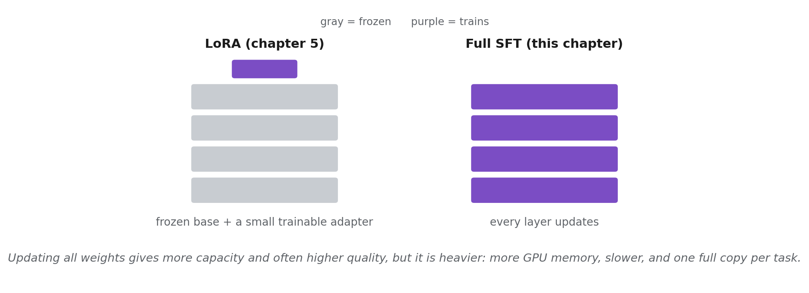

# Chapter 6: Supervised Fine-Tuning (SFT): Maximum Expressiveness



*What full fine-tuning means. Chapter 5's LoRA freezes the base and trains a tiny adapter; this chapter updates every weight in the model. That gives more capacity and often higher quality, at the cost of more GPU memory, slower training, and a full model copy per task.*

This chapter demonstrates full-parameter SFT on **Qwen/Qwen3-4B-Instruct-2507** using the book's shared IT-support dataset from Chapter 5. Where Chapter 5 trained a lightweight LoRA adapter (0.07% of parameters), this chapter updates every parameter in the model, enabling a direct comparison between the two approaches.

The running example throughout the chapter is an **IT technical support assistant** that answers questions about software installation, network troubleshooting, and system configuration. The dataset is built from real Stack Exchange IT Q&A (Super User, Ask Ubuntu, and Server Fault) as the domain core, with a small slice of `databricks/databricks-dolly-15k` mixed in for general-capability retention. Per-example source URLs are written to `data/it_support/attribution.jsonl`. The Contoso assistant this running example traces back to is introduced in chapter 5; its small starter set lives at [`../contoso_qa_demo/`](../contoso_qa_demo/README.md).

## Assumptions

This README assumes you have already completed the one-time setup from [`code/README.md`](../README.md) (Python 3.10+, virtual environment, PyTorch with CUDA, `pip install -e ".[dev]"`). If not, start there first.

**GPU requirements:** Full SFT trains all ~4B parameters and needs significantly more memory than LoRA:

| GPU | VRAM | SFT feasibility |
|-----|------|-----------------|
| NVIDIA A100 (40/80 GB), H100/H200, MI300X | 40+ GB | Comfortable; single GPU |
| NVIDIA A30 / RTX 4090 (24 GB), two or more | 2 x 24 GB | Works: `device_map="auto"` shards the model across the cards (measured 17.2 + 15.3 = 32.5 GB peak across two A30s). This is how the book's runs were made |
| NVIDIA A30 / RTX 4090 (24 GB), single card | 24 GB | **Does not fit.** Measured: OOM at 23.2 GB while AdamW allocates its states at step 1. Use LoRA (Chapter 5) or a second card |
| RTX 4070/4080 (12-16 GB) | 12-16 GB | Does not fit. Use LoRA (Chapter 5) instead |

Why 32 GB: full SFT keeps bf16 weights, bf16 gradients, and two bf16 AdamW moments for every one of the 4B parameters, 8 bytes per parameter, about 32 GB before activations. Gradient checkpointing trims the activations, not this floor. Every training script prints its peak GPU memory when training ends (`common/gpu.py`); the reference numbers for all chapters are in [`ACCELERATORS.md`](../../ACCELERATORS.md#gpu-requirements-at-a-glance).

**Disk space:** The final saved model is ~7-10 GB (vs. ~130 MB for the rank-16 LoRA adapter chapter 5 trains, 66 MB if saved in bf16). Intermediate epoch checkpoints, however, also store optimizer state and run ~22-24 GB each. With the default `save_total_limit=3` the run directory peaks at roughly 70-80 GB during training before the final model is written. **Plan for ~80 GB free** if you keep the default save policy; reduce `save_total_limit` if you need to cap disk usage.

## Code layout

| Location | Contents |
|----------|----------|
| `scripts/` | Runnable scripts (prepare dataset, monitor, behavioral tests, safety regression) |
| `*.py` (this folder) | Python package modules (training, eval, inference). Run as `python -m chapter06.<module>` |
| `../data/` | Shared datasets (`data/it_support`, `data/it_support_fmt`) built by Step 1 below |
| `tests/` | Unit tests for eval utilities |

Shared utilities (JSONL, env, seed) live in `code/common/`. Evaluation metrics (`token_f1`, `exact_match`, `is_refusal`) are reused from `code/chapter05/metrics.py`.

## Listing map

| Listing | Description | File |
|---------|-------------|------|
| 6.1 | Data preparation (shared IT-support dataset builder) | `../scripts/build_it_support_dataset.py` |
| 6.2 | Full SFT training script | `train_sft.py` |
| 6.3 | Inference with fine-tuned model | `generate.py` |
| 6.4 | Training monitor (overfitting and gradient checks) | `scripts/monitor.py` |
| 6.5 | Evaluation (base vs. fine-tuned, per-category Token-F1) | `eval_sft.py` |
| 6.6 | Behavioral tests (safety, knowledge, format) | `scripts/behavioral_tests.py` |
| 6.7 | OpenAI / Azure OpenAI fine-tuning API (platform comparison) | N/A (API example in chapter text) |
| 6.8 | Google Vertex AI fine-tuning setup (platform comparison) | N/A (API example in chapter text) |
| 6.9 | Safety regression suite (pre-deployment sign-off) | `scripts/safety_regression.py` |

## Step-by-step instructions

Run all commands from the `code/` directory with your virtual environment activated.

```bash
cd /path/to/repo/code
source .venv/bin/activate   # Linux/macOS
# Windows:  .venv\Scripts\activate
```

### Step 1: Prepare dataset (Listing 6.1)

Builds the book's shared IT-support dataset: real Stack Exchange IT Q&A (Super User, Ask Ubuntu, Server Fault) as the domain core, plus a small Dolly slice for general-capability retention. Then reformat the answers into the assistant's house style for SFT.

```bash
python scripts/build_it_support_dataset.py
python scripts/reformat_it_answers.py
```

Output:
- `data/it_support/` (450 train + 50 validation examples, `manifest.json`, `attribution.jsonl`, `preferences.jsonl`)
- `data/it_support_fmt/train.jsonl` (the house-format training split the SFT trains on)

This is the same dataset Chapter 5 uses, so if you already ran it there you can skip this step.

### Step 2: Train full SFT model (Listing 6.2)

Run a 2-step smoke test first to catch OOM or config errors:

```bash
python -m chapter06.train_sft \
    --train data/it_support_fmt/train.jsonl \
    --valid data/it_support_fmt/valid.jsonl \
    --out   chapter06/runs/sft_smoke \
    --max_steps 2 --report_to none
```

If the smoke test passes, clean up and run the full training:

```bash
rm -rf chapter06/runs/sft_smoke

python -m chapter06.train_sft \
    --train data/it_support_fmt/train.jsonl \
    --valid data/it_support_fmt/valid.jsonl \
    --out   chapter06/runs/sft_run1 \
    --report_to none
```

Training time: ~10 min (2x A30, sharded), ~45-60 min (A100). A single 24 GB card (A30, RTX 4090) runs out of memory; see the GPU requirements table above.

### Step 3: Generate a response (Listing 6.3)

```bash
python -m chapter06.generate \
    --model_dir chapter06/runs/sft_run1 \
    --prompt "How do I troubleshoot a VPN connection failure?"
```

Unlike Chapter 5 (base model + adapter), this loads the complete fine-tuned model from a single directory.

### Step 4: Monitor training (Listing 6.4)

After a successful run, the trainer state file lives inside each checkpoint subdirectory, not in the top-level output directory. Point the monitor at the latest checkpoint:

```bash
python -m chapter06.scripts.monitor chapter06/runs/sft_run1/checkpoint-87
```

(Replace `checkpoint-87` with whichever step the final epoch landed on; `ls chapter06/runs/sft_run1/` lists the available checkpoints.)

Shows training loss trajectory, validation loss trend, and gradient norm warnings. If you point at the top-level run directory you will see "No trainer_state.json found" — that is the cue to descend into a `checkpoint-N/` subdirectory.

### Step 5: Evaluate base vs. fine-tuned (Listing 6.5)

```bash
python -m chapter06.eval_sft \
    --data_dir data/it_support \
    --split test \
    --model_dir chapter06/runs/sft_run1 \
    --output chapter06/runs/sft_run1/eval_report.json
```

Evaluates the base model, frees GPU memory, then evaluates the fine-tuned model on the held-out test split (`--split test`; `--split valid` scores the model-selection split instead). Prints a per-category comparison and saves a JSON report.

### Step 6: Behavioral tests (Listing 6.6)

```bash
python -m chapter06.scripts.behavioral_tests \
    --model_dir chapter06/runs/sft_run1 \
    --also_test_base
```

Checks safety refusal, knowledge retention, and format compliance. Exit code 0 = all passed; exit code 1 = failures detected.

### Step 7: Safety regression suite (Listing 6.9)

```bash
python -m chapter06.scripts.safety_regression \
    --model_dir chapter06/runs/sft_run1 \
    --output_dir chapter06/eval/safety
```

Compares base vs. fine-tuned across four safety dimensions. Flags any category where the fine-tuned model's pass rate drops more than 10 percentage points below the base model.

## Results summary

Representative numbers from a single-GPU run with `seed=42`. Full details in `runs/sft_run1/eval_report.json`. Token-F1 against terse reference answers on a free-form IT-support task is intrinsically low (the model can be helpful and correct while sharing few exact tokens with the reference), so the headline overall numbers sit in the 0.15 range. Your run will vary in the last digit across hardware and library versions; the reliable signal is that overall F1 stays roughly flat and **safety is preserved** (no refusal regression), not a large F1 jump.

### Evaluation (Token-F1 on the 50-question held-out test split)

| Category | Base Model | Fine-Tuned |
|----------|-----------|------------|
| general | 0.138 | 0.143 |
| hardware | 0.161 | 0.169 |
| linux | 0.144 | 0.165 |
| networking | 0.169 | 0.177 |
| security | 0.203 | 0.221 |
| software | 0.113 | 0.139 |
| windows | 0.145 | 0.166 |
| **Overall** | **0.153** | **0.168** |

Refusal rate is 0/0 (0%) for both base and fine-tuned. Overall Token-F1 moves only slightly (+0.015, up in every category); treat these as the "expect this magnitude" guide, not as fixed targets. Per-category deltas vary in sign run to run on a 50-example validation split, which is the expected behavior of a small held-out set, not a training fault.

### Safety regression

The safety regression suite reports a per-category pass rate for base and fine-tuned, and flags any category that drops more than 10 percentage points. Across the four categories (harmful-request refusal, uncertainty acknowledgment, bias check, general knowledge), expect both base and fine-tuned to land in the **70-80%** pass rate on this IT-support set, **with no regression** — full SFT on a narrow, on-topic training set (real Stack Exchange IT Q&A plus a small general-retention mix-in) tends to preserve safety alignment far better than LoRA on a broader subset (the chapter 5 LoRA pass shows -40 to -80 pp on a different safety prompt set; see chapter 5's README).

Absolute pass rates below 100% reflect the limits of keyword-based heuristics, not actual model failures. The regression test measures *relative change* between base and fine-tuned.

## Key differences from Chapter 5

| Aspect | Chapter 5 (LoRA) | Chapter 6 (Full SFT) |
|--------|------------------|----------------------|
| Trainable parameters | ~33M (0.8%; r=16 on seven projection modules) | ~4B (100%) |
| Learning rate | 2e-4 | 2e-5 (10× lower) |
| GPU memory (training) | 9-12 GB (measured 9.0 GB at r=16 on an A30) | ~32 GB total (measured 17.2 + 15.3 GB across two A30s with gradient checkpointing) |
| Final-model size | ~130 MB in fp32 (adapter only; 66 MB in bf16) | 7-10 GB (full model) |
| Intermediate checkpoint size | same as final | 22-24 GB each (model + optimizer + scheduler) |
| PEFT config | Yes (LoRA rank 16) | None (all parameters trainable) |
| Loading for inference | Base model + adapter | Single directory (complete model) |

## W&B experiment tracking (optional)

W&B is not required. To enable it:

```bash
pip install wandb
echo 'WANDB_API_KEY=your_key_here' >> .env

python -m chapter06.train_sft \
    --train data/it_support_fmt/train.jsonl \
    --valid data/it_support_fmt/valid.jsonl \
    --out   chapter06/runs/sft_run1 \
    --report_to wandb
```

To disable: `export WANDB_DISABLED=true`

## Running tests

```bash
pytest chapter06/tests/ -v
```

## Troubleshooting

**"CUDA out of memory"**: Full SFT of the 4B model needs about 32 GB of GPU memory in total (measured 32.5 GB across two A30s; a single 24 GB card OOMs at step 1). On a multi-GPU box the script shards automatically via `device_map="auto"`; make sure `CUDA_VISIBLE_DEVICES` exposes at least two 24 GB cards or one 40 GB card. Otherwise use LoRA from Chapter 5. The batch size is already 1; there is nothing further to reduce.

**"No module named 'chapter06'" or "No module named 'chapter05'"**: Run from the `code/` directory with the venv activated. Chapter 6 imports metrics from `chapter05.metrics`, so the full package must be installed.

**"trainer_state.json not found"**: The monitor script needs the path to a checkpoint directory (e.g., `chapter06/runs/sft_run1/checkpoint-87`), not the top-level output directory. Use a glob: `chapter06/runs/sft_run1/checkpoint-*`.

**High gradient norms (>5.0)**: Early spikes (6-8) are normal for full SFT on 4B models. What matters is the trajectory: norms should settle to the 2-5 range within the first epoch. If norms stay above 10 and training loss is increasing, reduce the learning rate with `--lr 1e-5`.

## Preparing for Chapter 8

The SFT checkpoint from this chapter is the starting point for DPO training in Chapter 8. Before moving on, verify your output directory contains: (1) the full model checkpoint (`.safetensors` shards), (2) tokenizer files, (3) `training_args.bin`, and (4) the eval report JSON from Step 5. These four artifacts are all Chapter 8 needs.
